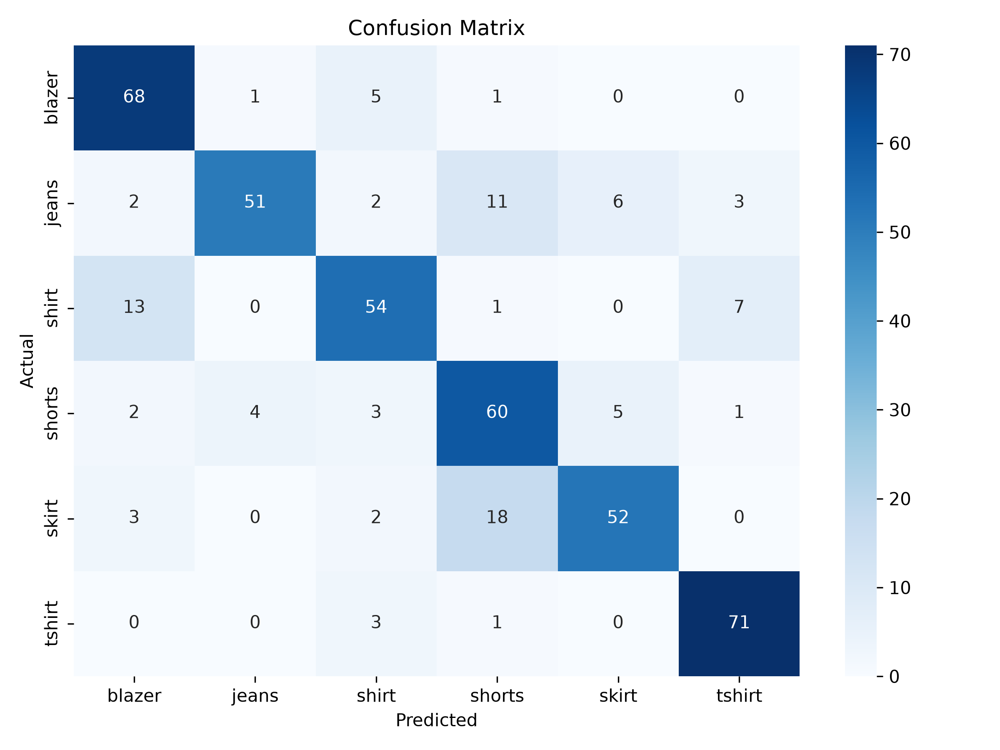

# Clothing Image Classification using MobileNetV2

A deep learning-based image classification project that classifies clothing images into **six clothing categories** using **MobileNetV2 Transfer Learning**. The project follows a complete machine learning workflow including data preprocessing, augmentation, multiple fine-tuning experiments, evaluation, and deployment through a Streamlit web application.

---

## Live Demo

**Streamlit App:** https://clothing-image-classifier.streamlit.app/

Try uploading an image of a **Blazer, Jeans, Shirt, Shorts, Skirt, or T-shirt** to test the deployed model.

---

## Project Overview

This project was developed to build a robust clothing image classifier while following an industry-standard transfer learning workflow. Instead of relying on a single training approach, multiple experiments were conducted to compare different fine-tuning strategies and select the best-performing model.

### Supported Clothing Categories

- Blazer
- Jeans
- Shirt
- Shorts
- Skirt
- T-shirt

---

## Final Model Performance

| Metric | Value |
|--------|------:|
| **Test Accuracy** | **82.44%** |
| Test Loss | **0.4634** |
| Macro Precision | **0.83** |
| Macro Recall | **0.82** |
| Macro F1-score | **0.82** |

The final model improved the baseline accuracy by **4.44 percentage points**.

---

## Experiment Summary

| Experiment | Strategy | Test Accuracy | Observation |
|-----------|----------|--------------:|------------|
| Baseline | Frozen MobileNetV2 | **78.00%** | Strong baseline with good overall generalization. |
| Experiment 2 | Fine-tuning from Layer 120 | **77.80%** | Improved Shirt and Shorts but slightly reduced overall accuracy. |
| Experiment 3 | Fine-tuning from Layer 140 | **74.40%** | Increased overfitting and reduced test performance. |
| **Final Model** | Stronger Data Augmentation + Two-Stage Fine-Tuning + ReduceLROnPlateau | **82.44%** | Best-performing model with balanced class-wise performance. |

---

## Dataset

- **Source:** Kaggle Clothes Dataset
- **Total Images Used:** **3,000**
- **Number of Classes:** **6**
- **Images per Class:** **500**

### Dataset Split

| Split | Images per Class | Total Images |
|-------|-----------------:|-------------:|
| Train | 350 | 2,100 |
| Validation | 75 | 450 |
| Test | 75 | 450 |

> **Note:** The dataset is not included in this repository due to its size. Download it from Kaggle and place it inside the `dataset/` folder.

---

## Data Augmentation

The final model used stronger augmentation during training to improve generalization.

- Rotation (20°)
- Width Shift (15%)
- Height Shift (15%)
- Zoom (20%)
- Shear (10%)
- Brightness Adjustment (0.8–1.2)
- Horizontal Flip

---

## Model Architecture

- **Base Model:** MobileNetV2 (ImageNet Pretrained)
- **Input Size:** 224 × 224
- **Classifier Head:**
  - GlobalAveragePooling2D
  - Dropout (0.3)
  - Dense (6 classes, Softmax)

### Training Strategy

#### Stage 1

- Frozen MobileNetV2 backbone
- Trained only the custom classification head.

#### Stage 2

- Unfroze the upper MobileNetV2 layers.
- Learning Rate: **1e-5**
- EarlyStopping
- ReduceLROnPlateau

This two-stage transfer learning strategy produced the highest-performing model.

---

## Evaluation

The model was evaluated using multiple metrics rather than accuracy alone.

- Test Accuracy
- Precision
- Recall
- F1-score
- Confusion Matrix

### Final Confusion Matrix



The final model achieved **82.44%** test accuracy across six clothing categories. During testing, the most noticeable practical limitation was distinguishing **Shirt** and **T-shirt**, as these visually similar categories can produce uncertain or incorrect predictions on some unseen images.

---

## Streamlit Web Application

The project includes a deployed Streamlit application that allows users to upload an image and receive:

- Predicted clothing category
- Confidence percentage
- Top-3 predictions
- Uncertain prediction handling for low-confidence cases

### Live Demo

**https://clothing-image-classifier.streamlit.app/**

### Run Locally

```bash
streamlit run app.py
```

---

## Project Structure

```text
clothing_image_classification/
│
├── ImageClassification.ipynb
├── app.py
├── README.md
├── requirements.txt
├── .gitignore
│
├── models/
│   ├── final_clothing_classifier.keras
│   └── final_clothing_classifier.weights.h5
│
├── outputs/
│   ├── confusion_matrix.png
│   ├── confusion_matrix_finetuned.png
│   └── confusion_matrix_exp3.png
│
├── sample_images/
│
└── dataset/
    ├── train/
    ├── validation/
    └── test/
```

> The `dataset/` directory is excluded from this repository. Download it from Kaggle before training the model locally.

---

## Technologies Used

- Python
- TensorFlow
- Keras
- MobileNetV2
- NumPy
- Matplotlib
- Seaborn
- Scikit-learn
- Streamlit

---

## Future Improvements

- Expand to additional clothing categories.
- Improve Shirt vs T-shirt discrimination.
- Increase dataset diversity for better real-world generalization.
- Optimize inference for faster deployment.

---

## Key Learning Outcomes

Through this project I gained practical experience in:

- Transfer Learning with MobileNetV2
- Two-Stage Fine-Tuning
- Data Augmentation
- Learning Rate Scheduling
- Model Evaluation using Precision, Recall, F1-score, and Confusion Matrix
- Building and deploying a Streamlit web application
- Comparing multiple ML experiments to select the best-performing model